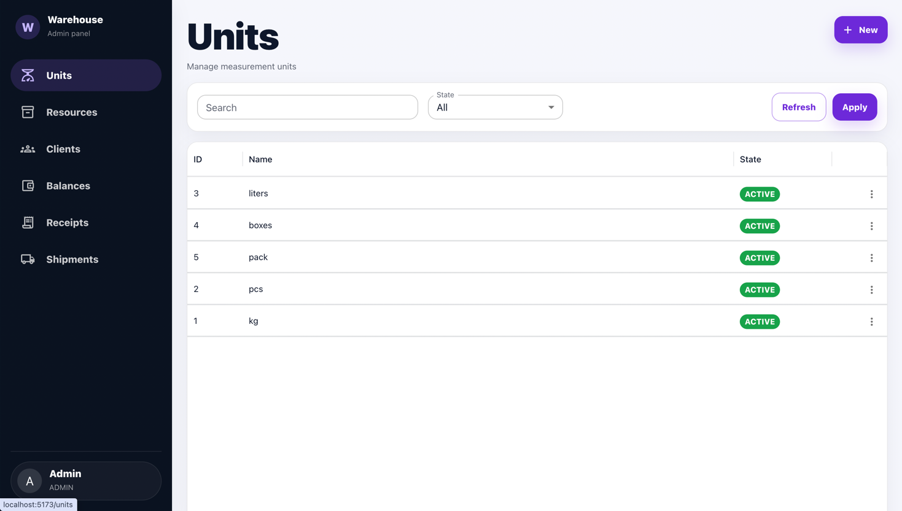
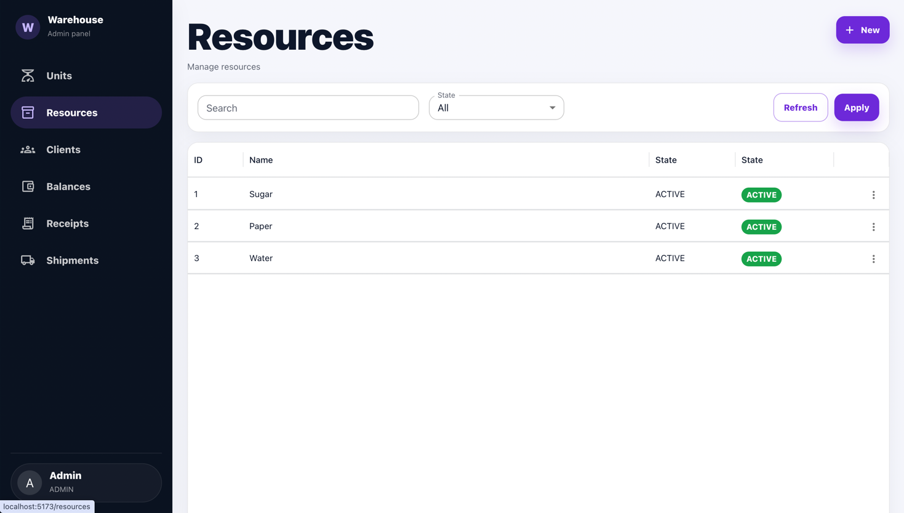
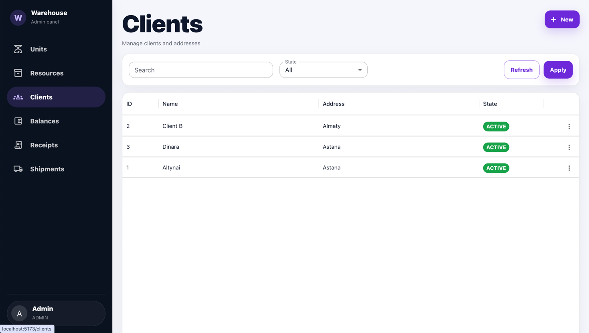
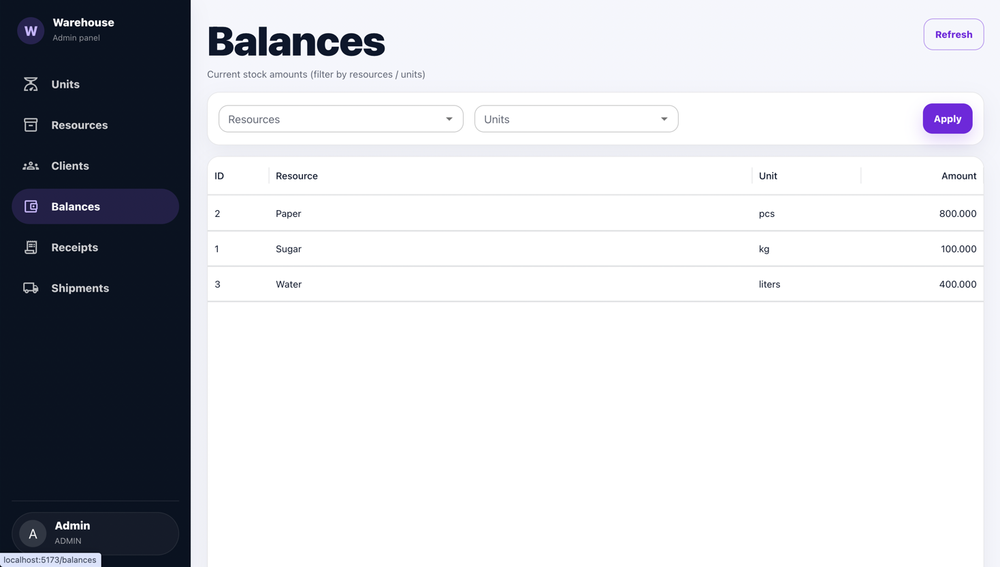
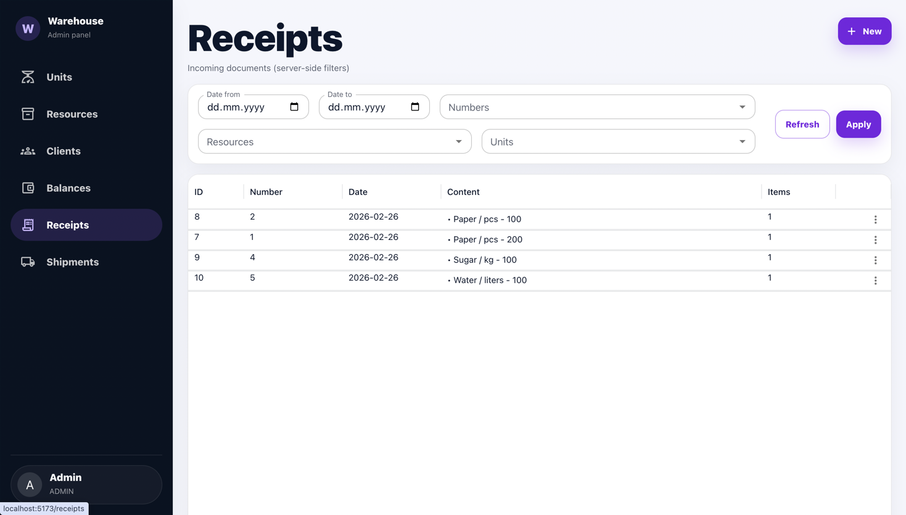
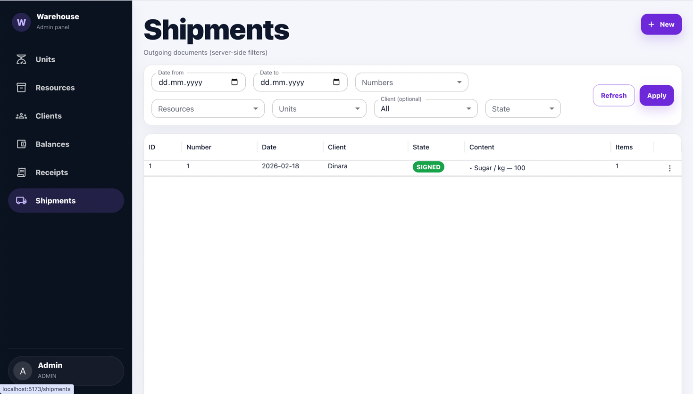

# Warehouse Management System

Full-stack warehouse management application built as a technical test task.

The system automates warehouse operations including:
- Resource management
- Units of measurement
- Clients
- Incoming documents (Receipts)
- Outgoing documents (Shipments)
- Stock balances tracking

---

### 🛠 Tech Stack

#### Backend
- Java 21
- Spring Boot 3
- Spring Data JPA
- PostgreSQL
- Maven

#### Frontend
- React
- TypeScript
- MUI (Material UI)
- Axios

---

### Implemented Functionality

Resources
Create / Update
Archive instead of delete
•	Unique name validation
•	Server-side filtering (search + state)

#### Resources
- Create / Update
- Archive instead of delete
- Unique name validation
- Server-side filtering (search + state)
>>>>>>> bedc3e87 (Update README)

#### Units
- Create / Update
- Archive instead of delete
- Unique name validation
- Server-side filtering

#### Clients
- Create / Update
- Archive instead of delete
- Unique name validation
- Filtering by state

---

#### Receipts (Incoming Documents)
- Create / Edit / Delete
- Multiple items per document
- Unique document number validation
- Server-side filtering:
  - Date range
  - Document numbers (multi-select)
  - Resources (multi-select)
  - Units (multi-select)
- Table displays document content
- Balance automatically increases on:
  - Create
  - Update (delta recalculation)
- Balance decreases on delete
- Negative stock prevention

---

#### Shipments (Outgoing Documents)
- Create / Edit / Delete
- Status management (DRAFT / SIGNED)
- Balance changes only on:
  - SIGN → subtract stock
  - REVOKE → restore stock
- Validation prevents negative balance
- Server-side filtering:
  - Date range
  - Numbers (multi-select)
  - Resources (multi-select)
  - Units (multi-select)
  - Client
  - State

---

#### Balances
- Aggregated by (resource + unit)
- Real-time updates
- Filtering by resource / unit

---

### Business Rules Implemented
- Unique entity names/numbers enforced
- Archive instead of delete when entity is used
- Archived entities cannot be selected in new documents
- Balance recalculates correctly on document updates
- Stock cannot go below zero
- Filtering is fully server-side
- Database auto-creation on startup

---

### Docker Setup
Run with Docker
The backend and PostgreSQL database can be started using Docker.

Location - Docker configuration is located inside the backend/ directory.
Start containers
cd backend
docker compose up --build

Services

After startup:
•	Backend: http://localhost:8080
•	PostgreSQL: localhost:5432

Stop containers
cd backend
docker compose down

### Database Setup

Create PostgreSQL database:
CREATE DATABASE warehouse;

Update backend configuration:

spring.datasource.url=jdbc:postgresql://localhost:5432/warehouse
spring.datasource.username=your_username
spring.datasource.password=your_password
spring.jpa.hibernate.ddl-auto=update

### How to Run
Backend
cd backend
./mvnw spring-boot:run

Runs at: http://localhost:8080

Frontend
Frontend is not containerized and should be started separately:

cd frontend
npm install
npm run dev

Runs at: http://localhost:5173

### Project Structure

backend/
└── src/main/java/com/example/warehouse
├── api
├── config
├── controller
├── dto
├── entity
├── exception
├── repository
├── service
├── util
└── StorageGovernmentApplication.java

backend/src/main/resources
└── db

frontend/
├── public
├── src
│   ├── api
│   ├── components
│   ├── pages
│   ├── types
│   ├── utils
│   ├── App.tsx
│   ├── main.tsx
│   ├── router.tsx
│   └── theme.ts
├── .env
└── node_modules

### Project Scope
This implementation covers:
- Junior-level requirements (Resources, Units, Receipts)
- Plus full Shipments logic (middle-level functionality)
- Complete stock recalculation logic
- Clean UI with filtering and status indicators

Author Dinara Medeubek

## 📸 Application MUI

| Units              | Resources              |
|--------------------|------------------------|
|  |  |

| Clients              | Balances              |
|----------------------|-----------------------|
|  |  |

| Receipts            | Shipments              |
|---------------------|------------------------|
|  |  |